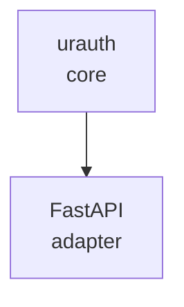
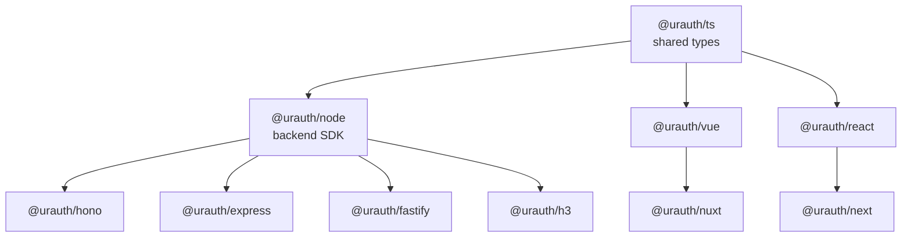

# Overview

**urauth** is a unified authentication and authorization library spanning Python and TypeScript. It provides a single, composable security layer that is secure by default, easy to test, and straightforward to extend — without requiring deep expertise in cryptographic protocols or token lifecycle management.

## Architecture

**Python**

<!-- diagram caption: "Python — core library with FastAPI adapter" -->

**TypeScript**

<!-- diagram caption: "TypeScript — shared core, backend SDK, middleware, and frontend packages" -->

## Packages

### pip

| Package | Runtime | Description |
|---------|---------|-------------|
| [urauth](/packages/py/) | Python 3.10+ | Core library with FastAPI adapter |

### npm

**Core**

| Package | Runtime | Description |
|---------|---------|-------------|
| [@urauth/ts](/packages/ts/) | Any JS | Shared TypeScript types, permissions, and authorization |
| [@urauth/node](/packages/node/) | Node.js 18+ | Backend SDK — JWT, token lifecycle, stores |

**Middleware**

| Package | Runtime | Description |
|---------|---------|-------------|
| [@urauth/hono](/packages/hono/) | Hono 4+ | Hono middleware |
| [@urauth/express](/packages/express/) | Express 4+ | Express middleware |
| [@urauth/fastify](/packages/fastify/) | Fastify 4+ | Fastify plugin |
| [@urauth/h3](/packages/h3/) | H3 / Nitro | H3 middleware (Nuxt server routes) |

**Frontend**

| Package | Runtime | Description |
|---------|---------|-------------|
| [@urauth/vue](/packages/vue/) | Vue 3 | Vue composables for auth state |
| [@urauth/nuxt](/packages/nuxt/) | Nuxt 3 | Nuxt module with auto-imports |
| [@urauth/react](/packages/react/) | React 18+ | React hooks for auth state |
| [@urauth/next](/packages/next/) | Next.js 14+ | Next.js App Router integration |

## Design Principles

- **Protocol-based** — Implement store interfaces against your database; no vendor lock-in.
- **Composable** — Permissions, roles, and relations compose with `&` / `|` operators.
- **Separator-agnostic** — `"user:read"` and `"user.read"` are semantically equal across all packages.
- **Hierarchical tenancy** — `TenantPath` carries full hierarchy through JWT claims, not just a flat ID.
- **Python-authoritative** — The Python package defines the canonical API; TypeScript stays in sync.
- **Secure by default** — Every default is the safe choice. Weakening requires an explicit, deliberate override.
