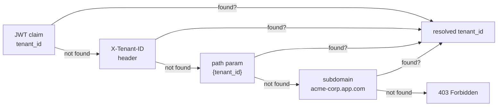
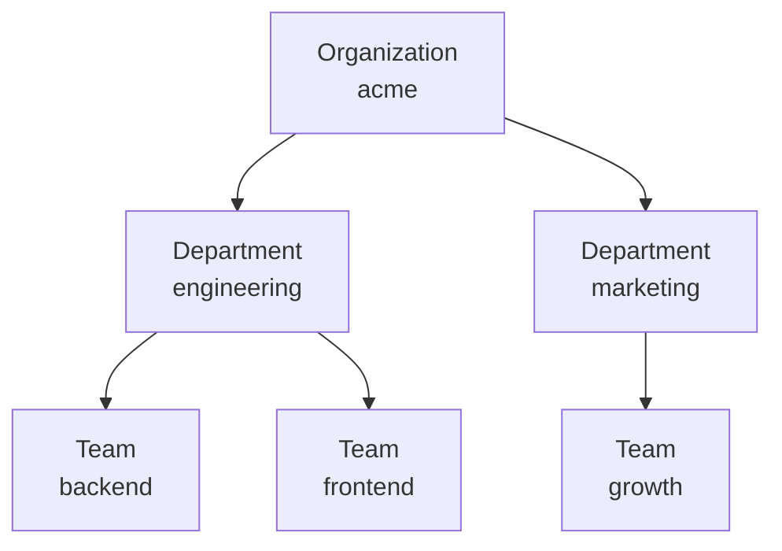

# Multi-Tenant

urauth supports multi-tenant applications where users belong to specific tenants (organizations, workspaces, teams). You can use a flat single-level tenant ID, or a full hierarchical model for complex organizational structures.

## Enable Multi-Tenant

Set `tenant_enabled=True` on the `Auth` instance:

```python
from urauth import Auth, JWT, Password
from urauth.backends.memory import MemoryTokenStore

class MyAuth(Auth):
    async def get_user(self, user_id):
        ...

    async def get_user_by_username(self, username):
        ...

    async def verify_password(self, user, password):
        ...


core = MyAuth(
    method=JWT(ttl=900, store=MemoryTokenStore()),
    secret_key="your-secret",
    password=Password(),
    tenant_enabled=True,
)
```

You can also use `namespace="project_a"` for multi-project auth separation, where different projects share the same infrastructure but have isolated auth contexts.

## Tenant Resolution Chain

The `TenantResolver` tries to resolve the tenant ID from multiple sources, in order:

::: code-group

**JWT Claim**


The tenant ID is embedded in the access token:

```python
from urauth.tokens.lifecycle import IssueRequest

# When issuing tokens, include tenant_id
pair = await core.lifecycle.issue(IssueRequest(
    user_id="1",
    tenant_id="acme-corp",
))
```

The resolver reads the `tenant_id` claim from the JWT.

```

**Header**


Send the tenant ID as a request header:

```bash
curl http://localhost:8000/api/data \
  -H "Authorization: Bearer eyJ..." \
  -H "X-Tenant-ID: acme-corp"
```

Configure the header name:

```python
core = Auth(
    ...
    tenant_enabled=True,
    tenant_header="X-Tenant-ID",  # default
)
```

```

**Path Parameter**


Include the tenant in the URL path:

```python
from fastapi import Depends

@app.get("/tenants/{tenant_id}/data")
async def get_data(
    tenant_id: str,
    tenant=Depends(resolver.current_tenant()),
):
    ...
```

```

**Subdomain**


Resolve from the request hostname:

```
https://acme-corp.yourapp.com/api/data
```

The resolver extracts the first segment of the hostname (`acme-corp`).

```
:::

<!-- diagram caption: "TenantResolver priority order — first match wins" -->

The resolver tries each source in order (JWT → header → path → subdomain) and returns the first non-empty value.

## Using the Tenant Dependency

```python
from urauth.fastapi.authz.multi_tenant import TenantResolver

resolver = TenantResolver(core)

@app.get("/data")
async def get_data(tenant_id: str = Depends(resolver.current_tenant())):
    return {"tenant": tenant_id, "data": "..."}
```


> **`warning`** -- See source code for full API.

If no tenant can be resolved from any source, the dependency raises `403 Forbidden`.

:::
## The TenantUser Protocol

For users that carry tenant information, add a `tenant_id` attribute to your user model:

```python
from dataclasses import dataclass, field


@dataclass
class User:
    id: str
    username: str
    hashed_password: str
    is_active: bool = True
    roles: list[str] = field(default_factory=list)
    tenant_id: str = ""
```

The `TenantUser` protocol requires `id`, `is_active`, and `tenant_id` properties. Any object with those attributes satisfies it.

## Combining with RBAC

Tenants and roles work together naturally. A user can be an `admin` in one tenant and a `viewer` in another:

```python
from fastapi import Depends
from starlette.requests import Request

from urauth.authz.primitives import Role
from urauth.fastapi.authz.multi_tenant import TenantResolver

resolver = TenantResolver(core)

@app.get("/tenant/settings")
@auth.require(Role("admin"))
async def tenant_settings(
    request: Request,
    tenant_id: str = Depends(resolver.current_tenant()),
    ctx=Depends(auth.context),
):
    return {"tenant": tenant_id, "user": ctx.user.id}
```

You can also use `AccessControl` guards alongside the tenant resolver:

```python
access = auth.access_control(registry=registry)

@app.get("/tenant/users")
@access.guard(Perms.USER_READ)
async def tenant_users(
    request: Request,
    tenant_id: str = Depends(resolver.current_tenant()),
):
    return {"tenant": tenant_id, "users": [...]}
```

For tenant-scoped role loading, override `get_user_roles` to return roles specific to the resolved tenant:

```python
class MyAuth(Auth):
    async def get_user_roles(self, user):
        from urauth.authz.primitives import Role

        # Load roles for the user's current tenant
        rows = await db.execute(
            "SELECT role_name FROM tenant_user_roles "
            "WHERE user_id = :uid AND tenant_id = :tid",
            {"uid": user.id, "tid": user.tenant_id},
        )
        return [Role(row.role_name) for row in rows]
```

## Tenant Hierarchy

For more complex organizational structures, urauth provides a hierarchical tenant system. Instead of a flat tenant ID, you can model trees like:


<!-- diagram caption: "Hierarchical tenancy — permissions cascade from Organization down to Teams" -->

### Enable Hierarchy

```python
core = MyAuth(
    method=JWT(ttl=900, store=MemoryTokenStore()),
    secret_key="your-secret",
    password=Password(),
    tenant_enabled=True,
    tenant_hierarchy_enabled=True,
    tenant_hierarchy_levels=["organization", "department", "team"],
)
```

### Define the Hierarchy

Use `TenantHierarchy` to define your levels:

```python
from urauth.tenant import TenantHierarchy

hierarchy = TenantHierarchy(["organization", "department", "team"])

# Inspect the hierarchy
hierarchy.root.name          # "organization"
hierarchy.leaf.name          # "team"
hierarchy.parent_of("team")  # "department"
hierarchy.children_of("organization")  # ["department"]
```

### TenantPath -- Hierarchy Context in Tokens

A `TenantPath` represents where a user is in the hierarchy:

```python
from urauth.tenant import TenantPath, TenantNode

# Build a path from root to leaf
path = TenantPath([
    TenantNode("acme", "organization"),
    TenantNode("engineering", "department"),
    TenantNode("backend", "team"),
])

path.leaf_id                    # "backend"
path.leaf_level                 # "team"
path.id_at("organization")     # "acme"
path.is_descendant_of("acme")  # True
```

Embed the full path in tokens when issuing:

```python
from urauth.tokens.lifecycle import IssueRequest

pair = await core.lifecycle.issue(IssueRequest(
    user_id="1",
    tenant_path={"organization": "acme", "department": "engineering", "team": "backend"},
))
```

The JWT will contain both a `tenant_path` claim (the full hierarchy) and a `tenant_id` claim (the leaf value, for backward compatibility).

### Resolving Tenant Path from Requests

Use `current_tenant_path()` to resolve the full hierarchy from a request:

```python
from urauth.fastapi.authz.multi_tenant import TenantResolver

resolver = TenantResolver(core)

@app.get("/data")
async def get_data(tenant=Depends(resolver.current_tenant_path())):
    org = tenant.id_at("organization")
    team = tenant.leaf_id
    return {"organization": org, "team": team}
```

The resolution order is:

1. `tenant_path` JWT claim -> full `TenantPath`
2. Flat `tenant_id` -> `TenantStore.resolve_path()` if a store is provided
3. Flat `tenant_id` -> wrapped in a single-node `TenantPath` (backward compat)

### Database-Backed Resolution

For production, provide a `TenantStore` to resolve full paths from your database:

```python
from urauth.tenant.protocols import TenantStore
from urauth.tenant import TenantPath, TenantNode


class SQLTenantStore:
    """Implement TenantStore with your database."""

    def __init__(self, session_factory):
        self._session_factory = session_factory

    async def get_tenant(self, tenant_id):
        async with self._session_factory() as session:
            result = await session.execute(
                select(Tenant).where(Tenant.slug == tenant_id)
            )
            row = result.scalar_one_or_none()
            return {"id": row.slug, "level": row.level, "parent_id": row.parent_id} if row else None

    async def get_ancestors(self, tenant_id):
        # Recursive CTE or walk up parent_id chain
        ...

    async def get_children(self, tenant_id):
        async with self._session_factory() as session:
            result = await session.execute(
                select(Tenant).where(Tenant.parent_id == tenant_id)
            )
            return [{"id": r.slug, "level": r.level} for r in result.scalars()]

    async def resolve_path(self, tenant_id):
        ancestors = await self.get_ancestors(tenant_id)
        tenant = await self.get_tenant(tenant_id)
        if not tenant:
            return None
        nodes = [TenantNode(a["id"], a["level"]) for a in ancestors]
        nodes.append(TenantNode(tenant["id"], tenant["level"]))
        return TenantPath(nodes)


# Wire it up
store = SQLTenantStore(session_factory)
resolver = TenantResolver(core, store=store)
```

### Tenant Context in AuthContext

The resolved tenant path is automatically attached to `AuthContext`:

```python
@app.get("/dashboard")
async def dashboard(ctx: AuthContext = Depends(auth.context)):
    # Backward-compatible flat ID
    ctx.tenant_id              # "backend" (leaf)

    # Full hierarchy context
    ctx.tenant.leaf_id         # "backend"
    ctx.at_level("organization")  # "acme"

    # Ancestry checks
    ctx.in_tenant("acme")      # True -- user is within this org
    ctx.in_tenant("other-org") # False

    return {"org": ctx.at_level("organization"), "team": ctx.tenant_id}
```

### Cascading Permissions

Permissions cascade down the hierarchy. A role at the Organization level grants access to all Departments and Teams below it:

```python
from urauth.authz.primitives import Permission


class MyAuth(Auth):
    async def get_tenant_permissions(self, user, level, tenant_id):
        """Load permissions scoped to a specific tenant level.

        Called for each level in the path (root -> leaf).
        """
        rows = await db.execute(
            "SELECT permission FROM tenant_memberships "
            "JOIN tenant_roles ON tenant_roles.id = tenant_memberships.role_id "
            "WHERE user_id = :uid AND tenant_id = :tid",
            {"uid": user.id, "tid": tenant_id},
        )
        return [Permission(row.permission) for row in rows]
```

The permissions are stored in `ctx.scopes`, keyed by level:

```python
@app.get("/report")
async def report(ctx: AuthContext = Depends(auth.context)):
    # Permissions from each level
    org_perms = ctx.scopes.get("organization", [])    # e.g., [Permission("org:admin")]
    team_perms = ctx.scopes.get("team", [])            # e.g., [Permission("team:read")]
    return {"org_permissions": len(org_perms), "team_permissions": len(team_perms)}
```

### Tenant Guard

Use `require_tenant()` to ensure a tenant context is present:

```python
# Require any tenant context
@auth.require_tenant()
async def tenant_endpoint(ctx: AuthContext = Depends(auth.context)):
    ...

# Require a specific hierarchy level
@auth.require_tenant(level="organization")
async def org_endpoint(ctx: AuthContext = Depends(auth.context)):
    ...

# Combine with a permission requirement
@auth.require_tenant(requirement=Permission("org", "admin"))
async def admin_endpoint(ctx: AuthContext = Depends(auth.context)):
    ...
```

Like all guards, `require_tenant()` works as both a `@decorator` and `Depends()`.

### Default Roles for Tenants

When creating new tenants, auto-provision default roles using `TenantDefaults`:

```python
from urauth.tenant import TenantDefaults, RoleTemplate

defaults = TenantDefaults()
defaults.register("organization", [
    RoleTemplate("employees", permissions=["org:read", "task:read"]),
    RoleTemplate("clients", permissions=["org:read:public"]),
    RoleTemplate("admin", permissions=["org:*"]),
])
defaults.register("team", [
    RoleTemplate("team_lead", permissions=["team:*"]),
    RoleTemplate("team_member", permissions=["team:read", "task:read", "task:write"]),
])
```

Then provision when a tenant is created:

```python
class MyProvisioner:
    async def provision(self, tenant_id, level, templates):
        for template in templates:
            await db.execute(
                "INSERT INTO tenant_roles (name, tenant_id, description) VALUES (:n, :t, :d)",
                {"n": template.name, "t": tenant_id, "d": template.description},
            )
            for perm in template.permissions:
                await db.execute(
                    "INSERT INTO role_permissions (role_name, tenant_id, permission) VALUES (:r, :t, :p)",
                    {"r": template.name, "t": tenant_id, "p": perm},
                )


provisioner = MyProvisioner()

# When creating a new organization:
async def create_organization(name: str, slug: str):
    await db.execute(
        "INSERT INTO tenants (name, slug, level) VALUES (:n, :s, 'organization')",
        {"n": name, "s": slug},
    )
    await defaults.provision(slug, "organization", provisioner)
```

### Database Models

urauth provides model mixins for the tenant hierarchy. Use them with SQLAlchemy or SQLModel:

::: code-group

```python [SQLAlchemy]
from sqlalchemy.orm import DeclarativeBase, relationship
from urauth.contrib.sqlalchemy.models import (
    TenantMixin, TenantRoleMixin, tenant_membership_table,
    UserMixin, user_role_table,
)

class Base(DeclarativeBase):
    pass

class Tenant(Base, TenantMixin):
    __tablename__ = "tenants"
    parent = relationship("Tenant", remote_side="Tenant.id", foreign_keys="Tenant.parent_id")
    children = relationship("Tenant", back_populates="parent")

class TenantRole(Base, TenantRoleMixin):
    __tablename__ = "tenant_roles"
    __table_args__ = (UniqueConstraint("name", "tenant_id"),)
    tenant = relationship("Tenant")

tenant_members = tenant_membership_table(Base)
```

```python [SQLModel]
from urauth.contrib.sqlmodel.models import TenantBase, TenantRoleBase

class Tenant(TenantBase, table=True):
    __tablename__ = "tenants"

class TenantRole(TenantRoleBase, table=True):
    __tablename__ = "tenant_roles"
```
:::
The `TenantMixin` provides: `id`, `name`, `slug`, `level`, `parent_id` (self-referential), `is_active`, `created_at`.

The `TenantRoleMixin` provides: `id`, `name`, `description`, `tenant_id`.

The `tenant_membership_table` creates a many-to-many with composite PK `(user_id, tenant_id, role_id)`, supporting multiple roles per tenant.

## Recap

**Flat tenant:**

- Set `tenant_enabled=True` on `Auth()`.
- `TenantResolver.current_tenant()` returns a flat tenant ID string.
- Returns `403` if no tenant can be resolved.
- Add `tenant_id` to your user model to satisfy `TenantUser`.
- Use `namespace="project_a"` for multi-project auth separation.

**Hierarchical tenant:**

- Additionally set `tenant_hierarchy_enabled=True` and `tenant_hierarchy_levels`.
- Use `TenantHierarchy` to define levels (Organization -> Department -> Team).
- `TenantPath` carries the full hierarchy through tokens and `AuthContext`.
- `TenantResolver.current_tenant_path()` resolves the full path.
- Permissions cascade down the hierarchy via `get_tenant_permissions()`.
- `TenantDefaults` auto-provisions roles like "employees" and "clients" when new tenants are created.
- `auth.require_tenant()` guards ensure tenant context is present.
- Model mixins (`TenantMixin`, `TenantRoleMixin`, `tenant_membership_table`) provide the database layer.
