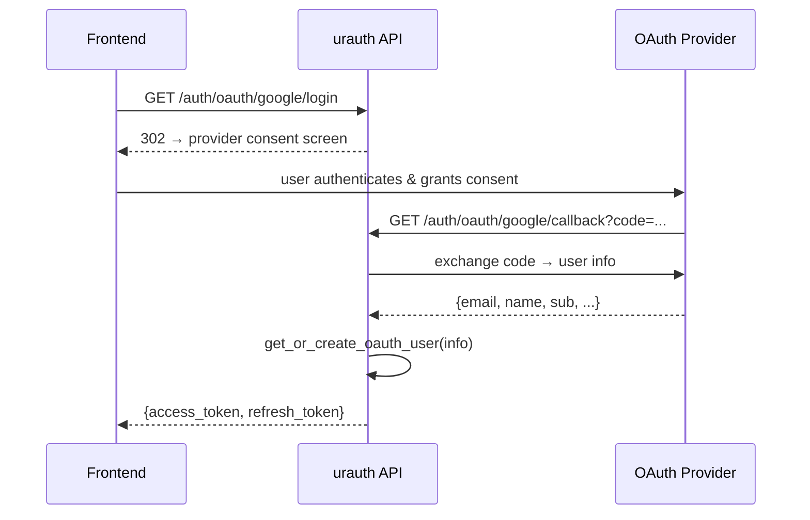

# OAuth2 & Social Login

Let users sign in with Google, GitHub, and other providers.

## Install

OAuth support requires the `oauth` extra:

```bash
pip install "urauth[oauth]"
```

## Configuration

Configure OAuth providers directly on the `Auth` instance:

```python
from urauth import Auth, JWT, Password, OAuth, Google
from urauth.backends.memory import MemoryTokenStore

class MyAuth(Auth):
    async def get_user(self, user_id):
        ...

    async def get_user_by_username(self, username):
        ...

    async def verify_password(self, user, password):
        ...

    async def get_or_create_oauth_user(self, info):
        """Resolve an OAuth identity to a local user."""
        user = await db.get_user_by_email(info.email)
        if user is None:
            user = await db.create_user(
                email=info.email,
                name=info.name,
                picture=info.picture,
                is_verified=info.email_verified,
            )
        return user


core = MyAuth(
    method=JWT(ttl=900, store=MemoryTokenStore()),
    secret_key="your-secret",
    password=Password(),
    oauth=OAuth(providers=[
        Google(client_id="your-google-client-id", client_secret="your-google-client-secret"),
    ]),
)
```

## Override get_or_create_oauth_user

The `get_or_create_oauth_user(self, info)` method on your `Auth` subclass is called after a successful OAuth callback. It receives an `OAuthUserInfo` object and must return a user object (or `None` to reject the login).

```python
class MyAuth(Auth):
    async def get_or_create_oauth_user(self, info):
        # Look up existing user by email
        user = await db.get_user_by_email(info.email)
        if user is not None:
            return user

        # Create a new user from OAuth info
        user = User(
            id=str(uuid4()),
            email=info.email or info.sub,
            name=info.name,
            picture=info.picture,
            hashed_password="",  # no password for OAuth-only users
            is_active=True,
            is_verified=info.email_verified,
        )
        await db.save_user(user)
        return user
```

The default implementation falls back to `get_user_by_username(info.email)`, which only works for users who already exist.

## OAuthUserInfo Fields

The `info` object passed to `get_or_create_oauth_user` contains:

| Field | Type | Description |
|-------|------|-------------|
| `provider` | `str` | Provider name (e.g., `"google"`, `"github"`) |
| `sub` | `str` | Provider's unique user ID |
| `email` | `str | None` | User's email address |
| `email_verified` | `bool` | Whether the provider verified the email |
| `name` | `str | None` | Display name |
| `picture` | `str | None` | Profile picture URL |
| `raw` | `dict | None` | Full raw response from the provider |

## auto_router Generates OAuth Routes

When you call `auth.auto_router()`, it reads the configuration and generates OAuth endpoints for each configured provider:

```python
from fastapi import FastAPI
from urauth.fastapi import FastAuth

auth = FastAuth(core)

app = FastAPI()
app.include_router(auth.auto_router())
```

For a configuration with Google OAuth, this creates:

- `GET /auth/oauth/google/login` -- redirects the user to Google's consent screen
- `GET /auth/oauth/google/callback` -- handles the callback, resolves the user, returns tokens

## The Login Flow


<!-- diagram caption: "OAuth 2.0 authorization code flow" -->

1. Your frontend redirects to `GET /auth/oauth/google/login`
2. The user authenticates with Google and grants consent
3. Google redirects back to `GET /auth/oauth/google/callback` with an authorization code
4. urauth exchanges the code for user info from the provider
5. `get_or_create_oauth_user(info)` resolves the OAuth identity to a local user
6. A JWT token pair (access + refresh) is returned

```bash
# Step 1: Redirect user to the login URL
# The endpoint returns a redirect to Google's consent screen
curl -L http://localhost:8000/auth/oauth/google/login

# Step 6: After the callback completes, the response contains tokens
{
  "access_token": "eyJ...",
  "refresh_token": "eyJ...",
  "token_type": "bearer"
}
```

## Account Linking

Enable account linking so users can connect multiple OAuth providers to a single account:

```python
core = MyAuth(
    method=JWT(ttl=900, store=MemoryTokenStore()),
    secret_key="your-secret",
    password=Password(),
    oauth=OAuth(providers=[
        Google(client_id="...", client_secret="..."),
        GitHub(client_id="...", client_secret="..."),
    ]),
    account_linking=True,
)
```

With `account_linking=True`, `auto_router()` generates additional endpoints:

- `POST /auth/link/{provider}` -- link an OAuth provider to the current user's account
- `DELETE /auth/link/{provider}` -- unlink an OAuth provider from the account
- `GET /auth/linked-accounts` -- list all linked providers for the current user

Override the corresponding hooks on your `Auth` subclass:

```python
class MyAuth(Auth):
    async def link_oauth(self, user, info):
        """Link an OAuth provider to an existing account."""
        await db.save_oauth_link(
            user_id=user.id,
            provider=info.provider,
            provider_user_id=info.sub,
            email=info.email,
        )

    async def unlink_oauth(self, user, provider):
        """Unlink an OAuth provider from an account."""
        await db.delete_oauth_link(user_id=user.id, provider=provider)

    async def get_linked_accounts(self, user):
        """List linked accounts for a user."""
        links = await db.get_oauth_links(user_id=user.id)
        return [
            {"provider": link.provider, "email": link.email}
            for link in links
        ]
```

## Supported Providers

urauth includes pre-configured defaults for six providers. You only need to supply your credentials:

| Provider | Class | OIDC |
|----------|-------|------|
| Google | `Google(client_id="...", client_secret="...")` | Yes |
| GitHub | `GitHub(client_id="...", client_secret="...")` | No |
| Microsoft | `Microsoft(client_id="...", client_secret="...")` | Yes |
| Apple | `Apple(client_id="...", client_secret="...")` | Custom |
| Discord | `Discord(client_id="...", client_secret="...")` | No |
| GitLab | `GitLab(client_id="...", client_secret="...")` | No |

All providers are imported from `urauth`:

```python
from urauth import Google, GitHub, Microsoft, Apple, Discord, GitLab
```

## Custom Provider

For providers not in the built-in list, use the base `OAuthProvider` class:

```python
from urauth import OAuthProvider

custom = OAuthProvider(
    name="custom-idp",
    client_id="...",
    client_secret="...",
    scopes=["openid", "profile", "email"],
    extra={
        "authorize_url": "https://idp.example.com/oauth/authorize",
        "token_url": "https://idp.example.com/oauth/token",
        "userinfo_url": "https://idp.example.com/oauth/userinfo",
    },
)

core = MyAuth(
    method=JWT(ttl=900, store=token_store),
    secret_key="...",
    oauth=OAuth(providers=[custom]),
)
```

## Multiple Providers

Add as many providers as you need. Each gets its own login and callback endpoints:

```python
from urauth import Auth, JWT, Password, OAuth, Google, GitHub, Discord

core = MyAuth(
    method=JWT(ttl=900, store=MemoryTokenStore()),
    secret_key="...",
    password=Password(),
    oauth=OAuth(providers=[
        Google(client_id="...", client_secret="..."),
        GitHub(client_id="...", client_secret="..."),
        Discord(client_id="...", client_secret="..."),
    ]),
)
auth = FastAuth(core)

app = FastAPI()
app.include_router(auth.auto_router())
# Creates:
#   GET /auth/oauth/google/login    + callback
#   GET /auth/oauth/github/login    + callback
#   GET /auth/oauth/discord/login   + callback
#   POST /auth/login (password)
#   POST /auth/refresh
#   POST /auth/logout
#   POST /auth/logout-all
```

## Recap

- Install `pip install "urauth[oauth]"`.
- Configure providers with `oauth=OAuth(providers=[...])` on the `Auth` instance.
- Override `get_or_create_oauth_user(info)` on your `Auth` subclass to resolve OAuth identities to local users.
- `auth.auto_router()` generates login and callback endpoints for each provider.
- Enable `account_linking=True` and override `link_oauth`, `unlink_oauth`, `get_linked_accounts` to let users connect multiple providers.
- Six providers are pre-configured (Google, GitHub, Microsoft, Apple, Discord, GitLab); use `OAuthProvider` for custom ones.

**Next:** [Access Control](rbac-permissions.md)
