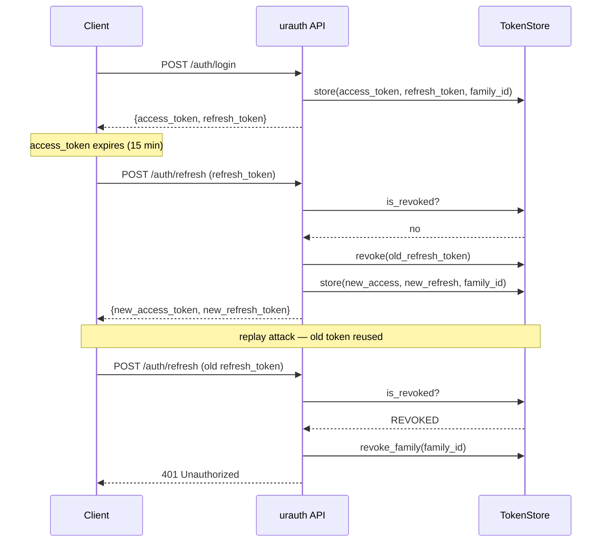

# Refresh Tokens

Access tokens are short-lived (15 minutes by default). Refresh tokens let users get new access tokens without logging in again.

## How It Works

When a user logs in, they receive a **token pair**:

- **Access token** -- short-lived, used for API requests
- **Refresh token** -- long-lived (7 days by default), used only to get a new access token


<!-- diagram caption: "Token rotation and replay-attack detection via family revocation" -->

```json
{
  "access_token": "eyJ...",
  "refresh_token": "eyJ...",
  "token_type": "bearer"
}
```

## Configuring TTLs

TTLs are configured directly on the `JWT` auth method:

```python
from urauth import Auth, JWT, Password
from urauth.backends.memory import MemoryTokenStore

class MyAuth(Auth):
    async def get_user(self, user_id):
        ...

    async def get_user_by_username(self, username):
        ...

    async def verify_password(self, user, password):
        ...


core = MyAuth(
    method=JWT(
        ttl=900,            # Access token: 15 minutes (default)
        refresh_ttl=604800, # Refresh token: 7 days (default)
        store=MemoryTokenStore(),
    ),
    secret_key="your-secret",
    password=Password(),
)
```

## Refreshing Tokens

Call `POST /auth/refresh` with the refresh token:

```bash
curl -X POST http://localhost:8000/auth/refresh \
  -H "Content-Type: application/json" \
  -d '{"refresh_token": "eyJ..."}'
```

You get a new token pair:

```json
{
  "access_token": "eyJ...(new)",
  "refresh_token": "eyJ...(new)",
  "token_type": "bearer"
}
```


> **`info`** — See source code for full API.

The new access token is **not** fresh. Only tokens from `POST /auth/login` are fresh.

:::
## Token Rotation

By default, `refresh=True` on the `JWT` auth method. Every time a refresh token is used, the old one is revoked and a new one is issued. This limits the window of exposure if a refresh token is leaked.

```python
core = MyAuth(
    method=JWT(
        ttl=900,
        refresh_ttl=604800,
        refresh=True,     # Enable refresh token rotation (default)
        revocable=True,   # Check token blocklist on each request (default)
        store=MemoryTokenStore(),
    ),
    secret_key="your-secret",
    password=Password(),
)
```

## Reuse Detection

::: danger Replay attack protection
If a revoked refresh token is used again, urauth revokes **all tokens in that family** -- logging the user out of every session. This protects against token theft.

:::
Refresh tokens belong to a **family** (tracked by `family_id`). When rotation creates a new token, it inherits the family. If someone replays an old (revoked) refresh token, the entire family is invalidated.

This requires a `TokenStore`. The built-in `MemoryTokenStore` tracks `family_id` on every token record and supports `revoke_family(family_id)` for whole-family invalidation. Use a persistent store in production (see [Custom Backends](../how-to/custom-backends.md)).

::: info How family tracking works in MemoryTokenStore
Each token is stored with a `family_id`. When a refresh token is used, the store looks up the family via `get_family_id(jti)`. If the token is already revoked, `revoke_family()` is called to invalidate every token sharing that family ID. This is the mechanism that catches replay attacks.

:::
## Token Lifecycle

All token operations -- issuing, validating, refreshing, and revoking -- are handled by `TokenLifecycle`. It coordinates JWT creation with store-based tracking and revocation so you never need to orchestrate multiple objects directly.

`TokenLifecycle` is created automatically when you instantiate `Auth` and is accessible as `core.lifecycle`:

```python
from urauth.tokens.lifecycle import TokenLifecycle, IssueRequest

# Issue tokens programmatically (normally handled by the router)
pair = await core.lifecycle.issue(IssueRequest(
    user_id="user-1",
    roles=["admin"],
    fresh=True,
))

# Validate an access token (JWT verification + revocation check in one call)
payload = await core.lifecycle.validate(raw_access_token)

# Refresh a token (rotation + reuse detection)
new_pair = await core.lifecycle.refresh(raw_refresh_token)

# Revoke a session (family-based revocation)
await core.lifecycle.revoke(raw_token)

# Revoke all tokens for a user
await core.lifecycle.revoke_all(user_id)
```

For advanced use cases (custom token types, raw JWT decode), use the escape hatch:

```python
# Direct access to the underlying TokenService
token_service = core.lifecycle.jwt
claims = token_service.decode_token(some_token)
```

## Logout

Revoke the current token:

```bash
curl -X POST http://localhost:8000/auth/logout \
  -H "Authorization: Bearer eyJ..."
```

Returns `204 No Content`.

## Logout All Sessions

Revoke all tokens for the user:

```bash
curl -X POST http://localhost:8000/auth/logout-all \
  -H "Authorization: Bearer eyJ..."
```

This revokes every access and refresh token the user has.

## Token Store

The `TokenStore` protocol tracks issued and revoked tokens. The default `MemoryTokenStore` works for development but does not persist across restarts.

```python
from urauth import Auth, JWT, Password
from urauth.backends.memory import MemoryTokenStore
from urauth.fastapi import FastAuth

# Default: MemoryTokenStore (fine for development)
core = MyAuth(
    method=JWT(ttl=900, store=MemoryTokenStore()),
    secret_key="...",
    password=Password(),
)
auth = FastAuth(core)

# Production: pass your own store (e.g., Redis-backed)
core = MyAuth(
    method=JWT(ttl=900, store=my_redis_store),
    secret_key="...",
    password=Password(),
)
auth = FastAuth(core)
```

See [Custom Backends](../how-to/custom-backends.md) for implementing a Redis-backed token store.

## Recap

- Login returns an access + refresh token pair.
- `POST /auth/refresh` exchanges a refresh token for a new pair.
- Token rotation (on by default) revokes old refresh tokens on use.
- Reuse detection invalidates the entire token family if a revoked token is replayed. `MemoryTokenStore` tracks families via `family_id`.
- `TokenLifecycle` is the single entry point for all token operations: `issue()`, `validate()`, `refresh()`, `revoke()`, and `revoke_all()`.
- `POST /auth/logout` revokes the current session; `POST /auth/logout-all` revokes all user tokens.
- Use a persistent `TokenStore` in production.

**Next:** [OAuth2 & Social Login](oauth2-social-login.md)
