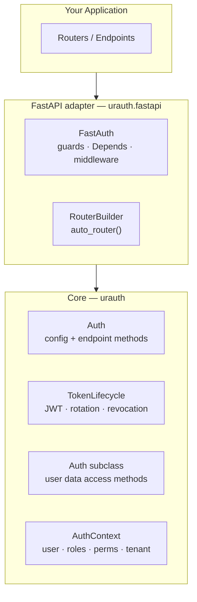
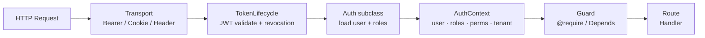
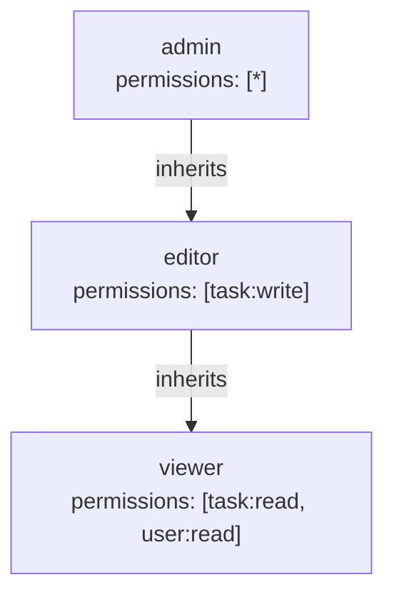
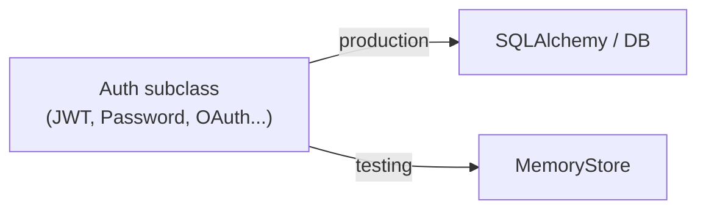

# Architecture

## Layer Structure

urauth is split into a framework-agnostic core and a FastAPI adapter that sits on top of it:


<!-- diagram caption: "urauth layer structure — core has no framework dependency" -->

## Request Pipeline

Every authenticated request passes through the same resolution chain before reaching a route handler:


<!-- diagram caption: "urauth request pipeline — token extraction through guard enforcement" -->

## Single Auth Instance

Create one `Auth` and one `FastAuth` instance per application. Share them across your routers via dependency injection or module-level singletons:

```python title="app/auth.py"
from urauth import Auth, JWT, Password
from urauth.backends.memory import MemoryTokenStore
from urauth.fastapi import FastAuth

class MyAuth(Auth):
    ...

core = MyAuth(
    method=JWT(ttl=900, store=MemoryTokenStore()),
    secret_key="...",
    password=Password(),
)
auth = FastAuth(core)
```

```python title="app/routers/tasks.py"
from app.auth import auth

@router.get("/tasks")
@auth.require(can_read_tasks)
async def list_tasks(ctx: AuthContext = Depends(auth.context)):
    ...
```

## Define Permissions as Constants

Declare your permissions once in a shared module. Use `PermissionEnum` for type safety and auto-completion:

```python title="app/permissions.py"
from urauth import PermissionEnum

class Perms(PermissionEnum):
    TASK_READ = ("task", "read")
    TASK_WRITE = ("task", "write")
    TASK_DELETE = ("task", "delete")
    USER_READ = ("user", "read")
    USER_ADMIN = ("user", "admin")
    ORG_ADMIN = ("org", "admin")
```

Then reference them across your codebase:

```python
from app.permissions import Perms

@access.guard(Perms.TASK_READ)
async def list_tasks(request: Request):
    ...
```

## Use RoleRegistry for Role Hierarchies

Define roles with inheritance in a single place. This keeps your authorization model explicit and auditable:

```python title="app/roles.py"
from urauth import RoleRegistry

registry = RoleRegistry()
registry.role("viewer", permissions=["task:read", "user:read"])
registry.role("editor", permissions=["task:write"], inherits=["viewer"])
registry.role("admin", permissions=["*"], inherits=["editor"])
```


<!-- diagram caption: "Role hierarchy — each role inherits all permissions from roles below it" -->


> **`tip`** -- See source code for full API.

Use `registry.include(other_registry)` to compose role registries from different modules in large applications.

:::
## Prefer Guards over Manual Checks

Guards are declarative, composable, and visible in your route definitions. Prefer them over manual `if` checks in your endpoint body:

```python
# Good -- declarative, visible, reusable
@auth.require(can_read_tasks & Role("member"))
async def list_tasks(ctx: AuthContext = Depends(auth.context)):
    return get_tasks()

# Avoid -- hidden logic, not reusable
async def list_tasks(ctx: AuthContext = Depends(auth.context)):
    if not ctx.has_permission(can_read_tasks) or not ctx.has_role("member"):
        raise ForbiddenError()
    return get_tasks()
```

## Use Auth Methods for Feature-Rich Applications

If your application needs multiple login methods, MFA, or password reset, configure them directly on `Auth` instead of wiring individual components:

```python
from urauth import Auth, JWT, Password, OAuth, MFA, Google, GitHub

core = MyAuth(
    method=JWT(ttl=900, refresh_ttl=604800, store=token_store),
    secret_key="...",
    password=Password(),
    oauth=OAuth(providers=[Google(...), GitHub(...)]),
    mfa=MFA(methods=["otp"]),
)
auth = FastAuth(core)
app.include_router(auth.auto_router())  # All routes generated
```

## Customize User Data Access via Auth Subclass

Override user data access methods directly on your `Auth` subclass. This makes it easy to swap backends (SQL, MongoDB, in-memory for tests) without changing your auth configuration:


<!-- diagram caption: "Auth subclass holds both auth config and user data access — swap the subclass to change backends" -->

```python title="app/auth.py"
from urauth import Auth, JWT, Password

class MyAuth(Auth):
    async def get_user(self, user_id):
        ...
    async def get_user_by_username(self, username):
        ...
    async def verify_password(self, user, password):
        ...

core = MyAuth(method=JWT(...), ...)
```

## Use Namespace for Multi-Project Separation

When multiple projects share the same infrastructure, use `namespace=` to isolate their auth contexts:

```python
# Project A
auth_a = AuthA(method=JWT(...), secret_key="...", namespace="project_a")

# Project B
auth_b = AuthB(method=JWT(...), secret_key="...", namespace="project_b")
```
